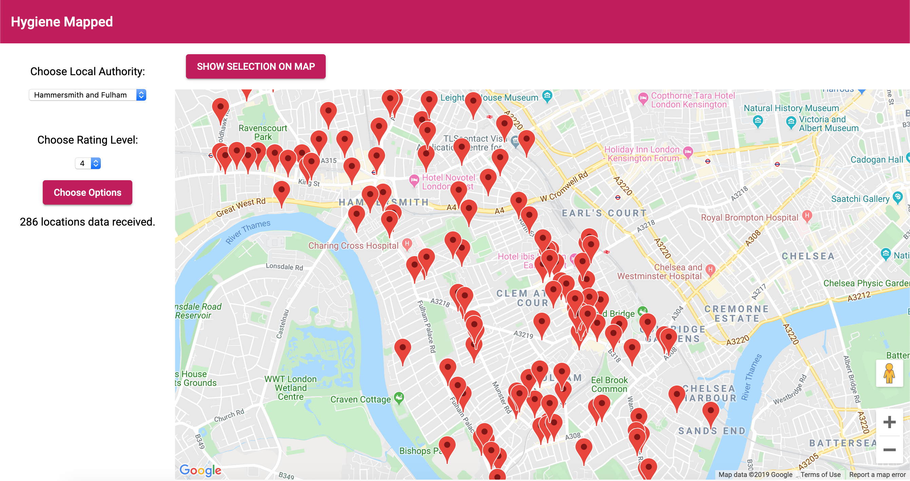

# Hygiene Mapped

## Introduction

This is a Food Hygeine Ratings App, where I have created a simple web application using the API and data sources at http://api.ratings.food.gov.uk/help that fulfils the user story below:

<b>
As a user:
I want to see on a map all the restaurants in selected Local Authority with specific food hygeine rating
</b>  

I wrote the application in Angular, to keep practicing my skills with the framework, and as the project scale grew, I know I wouldn't be able to manage the complexity in a vanilla Javascript project.

## Instructions to run

1. Clone the repo using `git clone git@gitlab.com:benAkehurst/hygiene-mapped.git`
2. Make sure you have node installed
3. `cd`into the directory, and run `npm install`
4. In the `data` folder, add a file called `keys.factory.ts`
5. In the `keys.factory.ts` file, add `export const gmApiKey: string = 'YOUR GOOGLE MAPS API KEY HERE';`
6. Then run `ng serve` and you can visit the app at http://localhost:4200/

## TODO's / Improvements

- design changes / colour scheme
- set the start point of the map to the users location
- add all national authoroties via api
